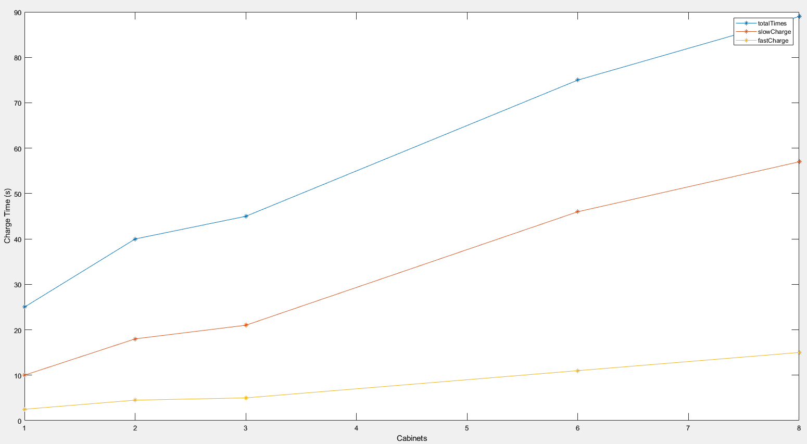

# Power supply charge

This document gathers the information obtained after charging the capacitor banks with different number of cabinets
available.

## Performed tests

### Capacitor bank cabinets active: 1

- Test date: 2023-03-07 14:03 UTC
- Total charge time: 25 seconds
  - Slow charge part: 10 seconds
  - Stabilization: ~12.5 seconds
  - Fast charge part: 2.5 seconds

### Capacitor bank cabinets active: 2

- Test date: 2023-03-07 14:07 UTC
- Total charge time: 40 seconds
  - Slow charge part: 18 seconds
  - Stabilization: ~17.5 seconds
  - Fast charge part: 4.5 seconds

### Capacitor bank cabinets active: 3

- Test date: 2023-03-07 14:11 UTC
- Total charge time: 45 seconds
  - Slow charge part: 21 seconds
  - Stabilization: ~19 seconds
  - Fast charge part: 5 seconds

### Capacitor bank cabinets active: 6

- Test date: 2023-03-07 14:23 UTC
- Total charge time: 75 seconds
  - Slow charge part: 46 seconds
  - Stabilization: ~18 seconds
  - Fast charge part: 11 seconds

### Capacitor bank cabinets active: 8

- Test date: 2023-03-07 14:29 UTC
- Total charge time: 89 seconds
  - Slow charge part: 57 seconds
  - Stabilization: ~17 seconds
  - Fast charge part: 15 seconds

## Conclusions

- Is difficult to obtain a linear approximation of how many capacitor banks are available based on the charge time.
  But based on the numbers above an approximation can be done based on the charge time.
- On the other hand, is easy to know that something is **NOT OK**, when the charge of the capacitor banks is performed
  in a few seconds.

Therefore, if the charge time is less than 80 seconds consider that something is wrong.
